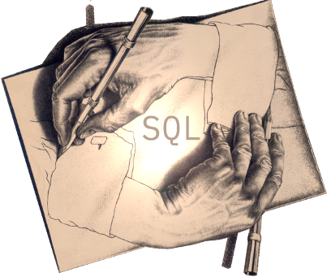

# Some iterations over recursion (in Db2)

In this repository, you find additional material, helpful links and more related to the talks on SQL recursion that [Michael Tiefenbach](https://twitter.com/globomike) and I have given at the [German Db2 User Group (DeDUG)](https://www.worldofdb2.com/group/dedug) and at the [IDUG EMEA DB2 Tech Conference](https://www.idug.org/emea2018).

The image below, based on Escher's drawing hands, is taken from this [blog post on two kinds of SQL recursion](https://blog.4loeser.net/2018/04/db2-cte-and-connect-by-two-kinds-of.html).

## Sample queries
Sample queries in this repository:
- [Db2-based Sudoku solver](db2_sudoku.sql), see below for SQLite original
- [compute factorial](factorial.sql)
- [XML test data generation](xml_test_data.sql)
- [compute table dependencies](dependencies.sql), use the catalog tables to determine best order to export database objects

## Flight route
Information on airports, airlines, connections and more is available on [OpenFlights](https://openflights.org/data.html). The script [flightroute_setup.sql](flightroute_setup.sql) provides the statements to set up tables and import data downloaded from OpenFlights.

Compute the flight routes to Philadelphia using [this query](flightroute.sql).

## Db2 References
References to the Db2 Knowledge Center
- [Common table expression (CTE)](https://www.ibm.com/support/knowledgecenter/SSEPGG_11.1.0/com.ibm.db2.luw.sql.ref.doc/doc/r0059217.html)
- [SQL to create a bill of material](https://www.ibm.com/support/knowledgecenter/SSEPGG_11.1.0/com.ibm.db2.luw.sql.ref.doc/doc/r0059242.html)
- [CONNECT BY expression](https://www.ibm.com/support/knowledgecenter/SSEPGG_11.1.0/com.ibm.db2.luw.apdv.porting.doc/doc/r0052877.html) and [Db2 compatibility](https://www.ibm.com/support/knowledgecenter/SSEPGG_11.1.0/com.ibm.db2.luw.apdv.porting.doc/doc/c0052882.html)

## Related blogs and links

- [Db2: CTE and CONNECT BY - two kinds of recursion](https://blog.4loeser.net/2018/04/db2-cte-and-connect-by-two-kinds-of.html)
- [Db2: Some Friday Fun with XML and SQL recursion](https://blog.4loeser.net/2018/08/db2-some-friday-fun-with-xml-and-sql.html)
- [SQLite WITH Clause, Sudoku and Mandelbrot](https://sqlite.org/lang_with.html)
- [Jupyter Notebook with DeDUG talk about SQL recursion](https://github.com/data-henrik/notebooks/blob/master/201804_DeDUG_SQLRecursion.ipynb)